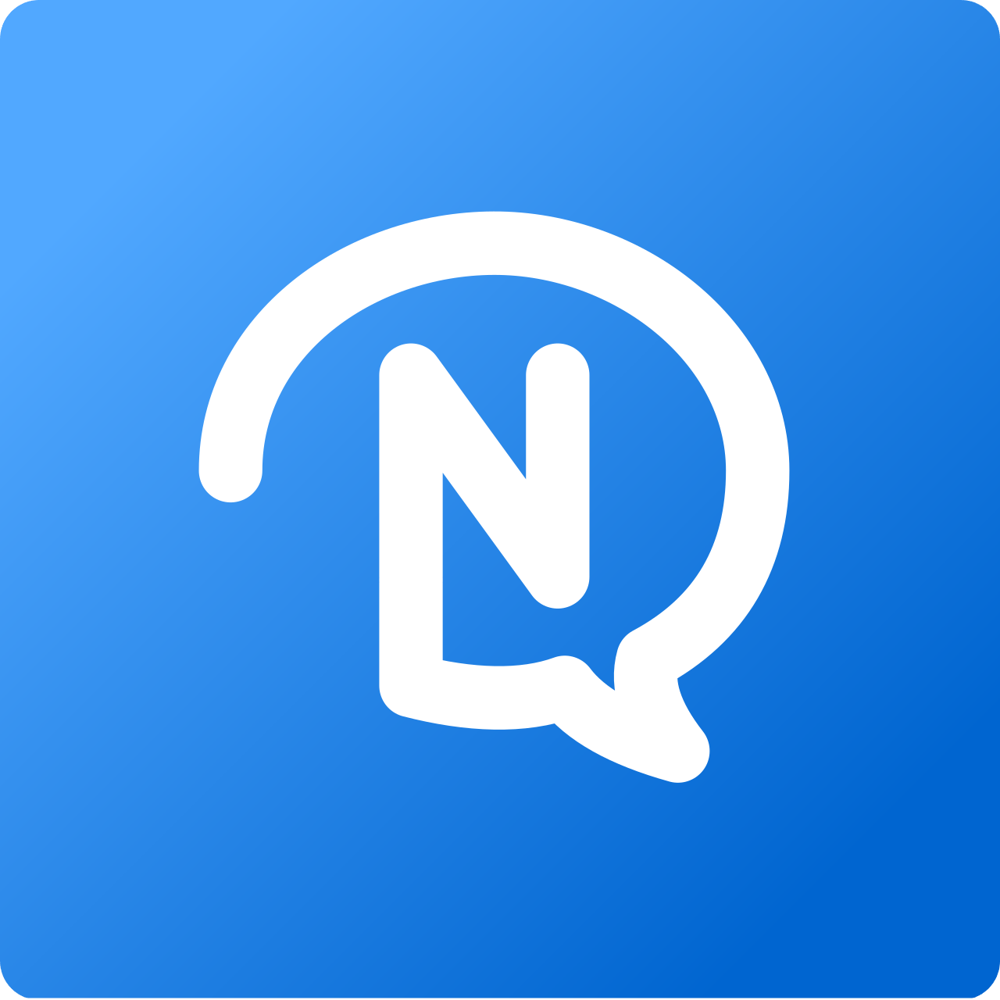

<div align="center">
    
    <h1>nin0chat</h1>
    <p>
        The chat app of all time. Easy to use, simple and open.
    </p>
</div>

---

## 📝 Table of contents

- [About](#about)
- [Get started](#get_started)
- [License](#license)

## 🧐 About 

nin0chat is a silly simple chatroom that allows people to easily join just by opening the website and starting to chat. The goal is to have IRC, but better. This project was built using TypeScript, ElysiaJS, and Postgres. 

Thanks to all the contributors who helped make this project possible!

## 🚀 Get started

As a user: go to https://chat.nin0.dev.
As a selfhoster:
<details>
    <summary>Self-hosting guide</summary>
To get started with nin0chat, you will need to have the following installed on your machine:

- Node.js
- pnpm
- Postgres

Once you have the above installed, you can clone the repository and install the dependencies:

```bash
git clone https://github.com/nin0chat/rewrite.git
cd rewrite
pnpm install
```

After installing the dependencies, there will be a `config.example.ts` file in the root directory. You will need to copy this file to `config.ts` and fill in the necessary variables.

Once you have filled in the variables, you can run the following command to start the server:

```bash
pnpm dev
```

or:

```bash
pnpm build && pnpm start
```

if you are running a production instance.

You should then be able to access the server on your desired port.
</details>

## 📜 License

This project is licensed under the APGL-3.0 License - see the [LICENSE](LICENSE) file for details.
